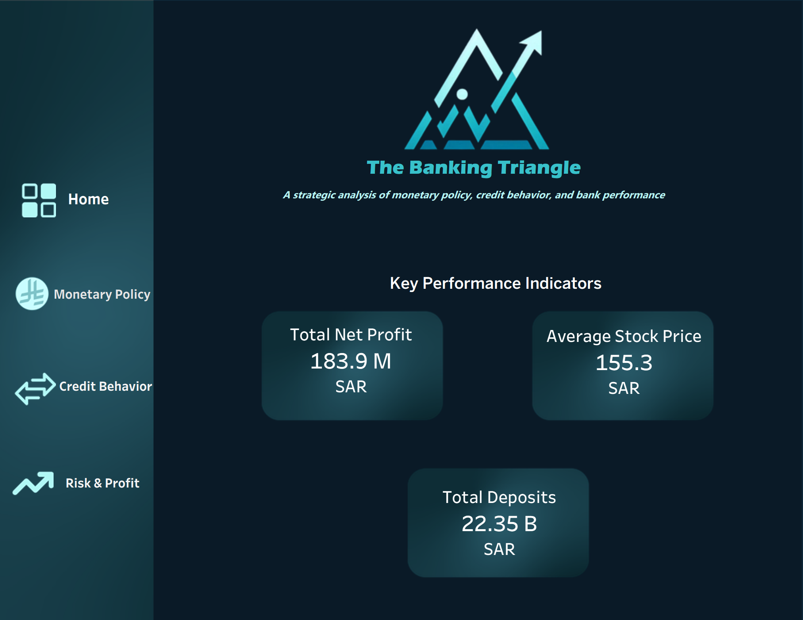

# 🏦 The Banking Triangle

## 📋 Project Overview  

This project analyzes the performance of the Saudi banking sector by examining the dynamic relationship between central bank monetary policy and market outcomes. Within the broader framework of Saudi Vision 2030, the financial sector serves as a foundational driver of economic transformation and housing market expansion.

The analysis is structured around what I define as the “Banking Triangle” — a strategic framework connecting three interdependent pillars: Monetary Policy (interest rates – SAIBOR), Consumer Credit Behavior (mortgage financing trends), and Institutional Profitability (banking sector performance).

The central question guiding this dashboard is:

> *To what extent do fluctuations in interest rates (SAIBOR) influence mortgage financing volumes and the overall profitability of Saudi banks?*

By addressing this question, the dashboard provides stakeholders with a clear, data-driven visualization of how macroeconomic policy decisions cascade through the financial system — influencing both individual borrowers and major financial institutions.

---

## 📊 Data Source & Reliability  

The analytical foundation of this project is built on officially published data from two primary institutional sources:

**Saudi Central Bank (SAMA)** Open Data Portal — selected for its institutional reliability and authoritative macro-financial indicators.

**Saudi Exchange (Tadawul)** — used to obtain quarterly financial statements of listed Saudi banks, enabling deeper analysis of net profits, total assets, deposits, and dividend trends.

The combined dataset spans from 2022 to 2025 and integrates structured time-series and categorical financial data, allowing for a comprehensive macro-to-micro sector analysis.

📂 **Project Assets:**
* All raw and processed datasets are available in the [data directory](https://github.com/layanemran/The-Banking-Triangle-/tree/main/data).

---

## ⚙️ Methodology & Analytical Approach  

To transform raw institutional data into a structured and strategic financial dashboard, a multi-stage analytical workflow was implemented.

First, all monetary values were standardized into SAR (Millions/Billions) to ensure cross-dataset comparability. Because reporting frequencies differed between sources, quarterly bank reports were carefully aligned with monthly SAIBOR data to construct a synchronized analytical timeline.

During preprocessing in Excel, calculated fields In instances where certain fourth-quarter data points were partially incomplete, available sub-period values were aggregated and validated against annual summaries to preserve quarterly continuity while maintaining transparency.

The analytical framework centers on exploring the relationship between SAIBOR movements and mortgage financing volumes, particularly during tightening cycles. Rather than presenting isolated KPIs, the dashboard is structured to reveal how liquidity conditions and interest rate environments are associated with changes in credit demand and institutional profitability.

For visualization, Tableau was selected due to its advanced interactive features, dynamic filtering, and drill-down capabilities that allow non-technical stakeholders to explore layered insights intuitively. Excel was used extensively for data cleaning, preprocessing, validation, and structural preparation prior to deployment.

From a design perspective, the dashboard adopts a dark-mode interface to reflect a professional FinTech aesthetic, enhance visual contrast of KPIs, and reduce viewer fatigue. The layout follows a hierarchical structure that guides users from macroeconomic indicators to mortgage dynamics and ultimately to banking performance outcomes.

---

## 🖼️ Dashboard Preview  

### 1️⃣ The Strategic Gateway (Home)
**Purpose:** Establishes the visual identity and provides an executive summary of key performance indicators (KPIs).

**Key Metrics:** Showcases high-level summaries including Total Net Profit (SAR 183.9M), Average Stock Price, and Total Deposits (SAR 22.35B).

---

### 2️⃣ Monetary Policy & Liquidity Dynamics
**Purpose:** Analyzes the correlation between interest rate fluctuations (SAIBOR) and market liquidity.

**Analysis:** Visualizes Money Supply Growth against interest rate changes and tracks the reallocation of deposits between current accounts and savings in a high-rate environment.

---

### 3️⃣ BCredit Behavior & Market Adjustment
**Purpose:** Focuses on the consumer lending landscape, specifically the mortgage market.

**Insights:** Highlights the impact of interest rates on mortgage financing and provides a detailed breakdown of real estate loans by property type (Villas, Apartments, Land).

---

### 4️⃣ Bank Performance & Risk Assessment
**Purpose:** Evaluates the institutional health and efficiency of the Saudi banking sector.

**Detailed View:** Tracks Net Profit vs. SAIBOR, Lending Efficiency (LDR), and Credit Quality (NPL Ratios) across major institutions like SNB, Al Rajhi, and Alinma.

---

### 🔗 Live Interactive Dashboard
Experience the full interactivity of this analysis on Tableau Public:
👉 **[View Live Dashboard on Tableau Public](https://public.tableau.com/views/TheBankingTriangle/Home?:language=en-US&publish=yes&:sid=&:redirect=auth&:display_count=n&:origin=viz_share_link)**

---

## ⚠️ Assumptions & Limitations  

While the dashboard provides a structured macro-financial interpretation, certain limitations apply:

- SAIBOR is treated as a primary proxy for monetary policy impact, although additional macroeconomic factors also influence mortgage demand.
- Some partially incomplete Q4 data required aggregation from available sub-period values to maintain continuity.

---

## 💡 Key Insights & Strategic Implications  

The analysis reveals several meaningful patterns across the Saudi banking sector between 2022 and 2025:

- **Rate Sensitivity:** Rising SAIBOR levels correspond with moderation in mortgage financing volumes, particularly in residential segments.
- **Profit Resilience:** Despite credit volatility during tightening cycles, banking sector profitability remained relatively resilient, likely supported by improved margins.
- **Adaptive Liquidity:** Shifts between demand and time deposits reflect adaptive liquidity management within the banking system during policy transitions.

From a strategic perspective, stakeholders should closely monitor interest rate cycles when forecasting mortgage demand while maintaining focus on balance sheet resilience and long-term institutional stability.

